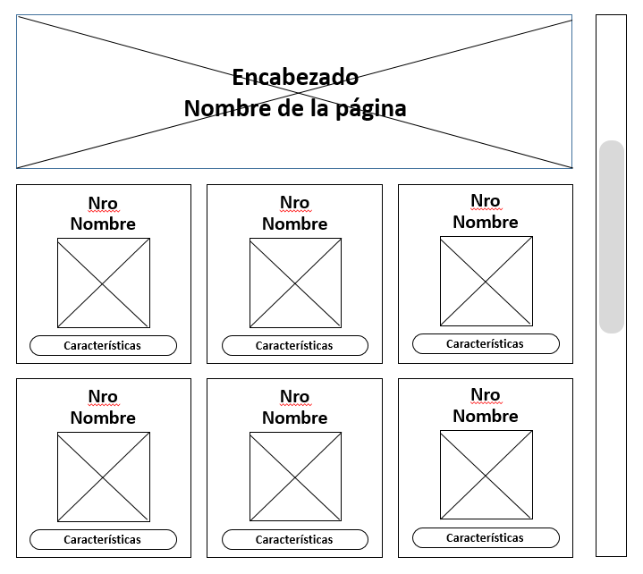
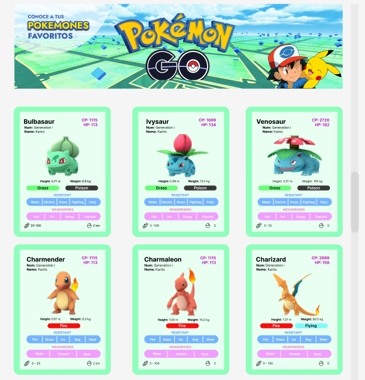
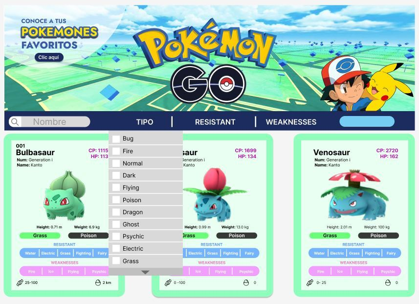
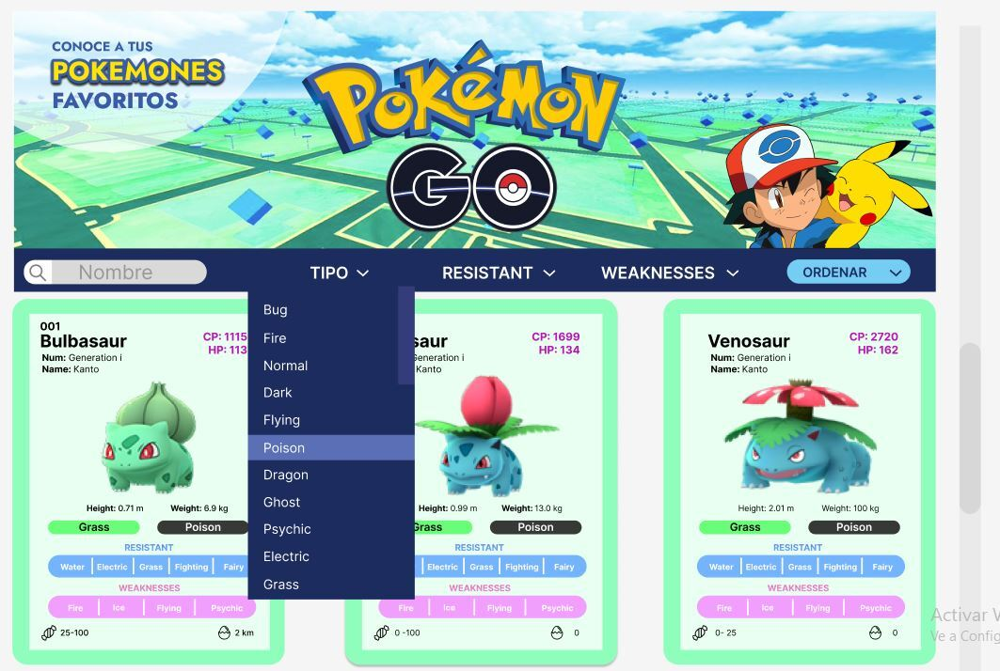
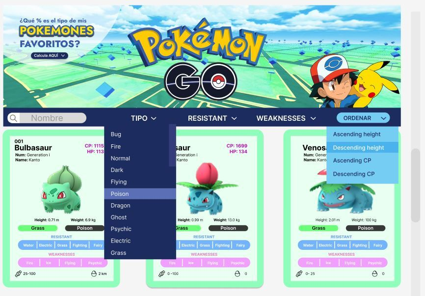

# Data Lovers - POKÉMON GO

***
## 1. Definición del producto
Es una página web que complementa al juego Pokémon Go, brindando información adicional como:
+ Filtrar por : Tipos, Resistencias, Debilidades. 
+ Permite ordenar de acuerdo a la altura y CP.
+ Obtener de manera rápida el porcentaje de los tipos de cada Pokémon.
## 2. Investigación de UX
Para poder conocer a nuestros usuarios realizamos un sondeo en un grupo de usuarios novatos en el juego Pokémon Go. En donde se les preguntó sobre las espetativas que tenían respecto a la página web y cuál era la información relevante que ellos consideraban que la página debía de tener para poder iniciar en el mundo de Pokémon Go.
### Conclusiones:
* Público Objetivo: Jugadores novatos en un rango de 25 a 35 años.
* Los usuarios buscan conocer las características de los pokemones para aumentar las posibilidades de éxito en el juego.
* Desean utilizar el producto en su tiempo libre.
## 3. Historia de usuario
### Historia N°1
**Como:** Jugador novato de Pokémon Go\
**Quiero:** Conocer/visualizar las características de los pokemones más populares \
**Para:** Entrar al mundo de este juego.
**Criterios de aceptación**
- Que la página sea responsive (celular , tablet y desktop).
- Que el Usuario logre ver los 251 Pokemones en 84 filas de 3 columnas .
- En cada tarjeta de Pokemon el Usuario vera: la imagen del Pokemon, nombre, número , tipo, peso , talla, HP, CP , egg , resistant ,weaknesses, candies; fiel a prototipo de alta fidelidad.
- El usuario logrará ver los 251 Pokemones de manera continua escroleando.
- El Usuario podrá ver un encabezado con la temática de la página.
### Prototipo de baja fidelidad

### Prototipo de alta fidelidad

### Historia N°2
**Como:** Yo, como jugadora novata de Pokemon Go, 
**Quiero:** Filtrar los pokemones por: nombre , tipo, resistencia y debilidad / 
**Para:** Ubicar de manera rápida los elementos deseados. Y así conocer las características de mi pokemon y de mis adversarios.\
**Criterios de aceptación**
- El usuario visualizará 4 botones para realizar los filtros: nombre ,tipo, debilidades y resistencia.
- En el input "Nombre Pokémon", se podrá escribir el nombre del Pokémon a buscar.
- Al dar clic en cada uno de los botones, se despliega una lista para que el usuario escoja una característica a filtrar.
- Al dar clic se visualizará el resultado de la elección.
### Prototipo de alta fidelidad

### Historia N°3
**Como:** Jugadora de Pokémon Go Novata.\
**Quiero:** poder ordenar los diferentes tipos de pokemones de acuerdo a :Height y CP de manera ascendente y descendente en ambos casos/ poder encontrar de manera rápida las características que busco de cada personaje ..\
**Para:** Poder encontrar de manera rápida las características que busco de cada personaje ..\
**Criterios de aceptación**
- Poder visualizar en la interfaz el selector Ordenar .
- Visualizar las 4 opciones para ordenar en una lista desplegable.
- Al seleccionar una de las 4 opciones, se visualizará el resultado  en un Alert de la elección.
### Prototipo de alta fidelidad

### Historia N°4
**Como:** Yo, como jugadora novata de Pokemon Go, 
**Quiero:** poder realizar algunos cálculos con la data disponible en ésta página, como : hallar los porcentajes de pokemones por Tipo / 
**Para:** Saber el porcentaje de su poblacion-clasificación, las crean relaciones entre ellos basadas en las ventajas y debilidades de los tipos. \
**Criterios de aceptación**
- Visualizar en la interfaz botón para realizar el cálculo.
- Se desplegará una lista con los tipos de pokemones, para seleccionar el tipo del que se desea saber su porcentaje.
- El resultado se mostrará en un Alert.
### Prototipo de alta fidelidad
